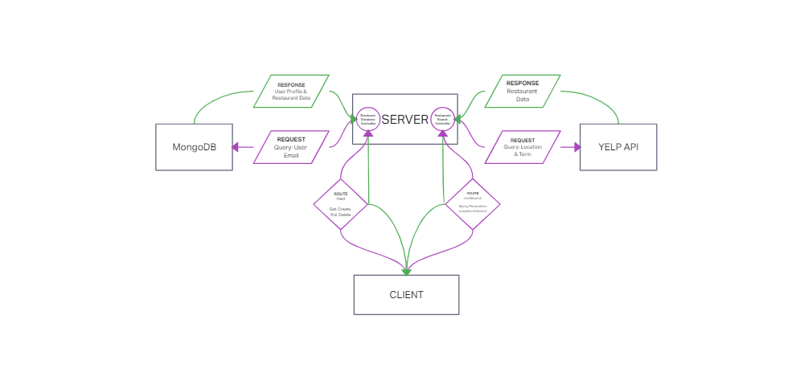

# Best Bites

## Author: Justin Hamerly-Spain

[Server Documentation](./server/README.md)

[Client Documentation](./client/README.md)

[Deployed App](https://best-bites.netlify.app/);

### V.1.0.0

---

### ABOUT

*Best Bites* is a web app for tracking favorite restaurants and meals.  It offers suggestions for similar restaurants and a map of visited restaurants.

---

### PROBLEM DOMAIN

A one stop shop for decision making when unsure of where to eat tonight.  For times when you want something to eat but are unsure of what restaurant to visit, Best Bites offers a personal collection of your favorite places to eat with reminders of what you had.

---

### TECHNOLOGIES

|Type|List|
|:--|:--|
|Language and Libraries|Typescript, JavaScript, React, Node.js, Express|
|Database and Deployment| MongoDB (NoSQL Database), Netlify (frontend), Heroku (backend)|
|Integrations| Auth0, YelpAPI, MapBox|

---

### USER STORIES

---

### UML

